# Color palettes in athanor

`athanor` includes `named_colors`, a curated list of named character
vectors that map categorical values to hexadecimal colors. These can be
passed as the `clrs_specific` argument in plotting functions and are
designed to be consistent and colorblind-friendly.

In addition, a companion function called
[`plot_color_scale()`](https://eba28.github.io/athanor/reference/plot_color_scale.md),
generates a data-anchored diverging color scale for continuous data
which is particularly useful with Seurat’s `DotPlot`.

------------------------------------------------------------------------

## Setup

``` r

library(athanor)
library(dplyr)
library(ggplot2)
library(Matrix)
library(patchwork)
library(Seurat)

# helper to display a named color vector as a swatch strip
# could also use colorspace::swatchplot() or scales::show_col()
show_palette <- function(colors, title = "") {
  if (names(colors) %>% is.null()) {
    names(colors) <- seq_along(colors)
  }

  df <- data.frame(x = seq_along(colors),
                   label = factor(names(colors), levels = names(colors)),
                   fill = unname(colors))

  ggplot(df, aes(x = label, y = 1, fill = I(fill))) +
    geom_tile(color = "white", linewidth = 0.3) +
    labs(title = title) +
    theme_void() +
    theme(plot.title = element_text(size = 9, hjust = 0.5),
          axis.text.x = element_text(size = 7, angle = 45, hjust = 1))
}
```

------------------------------------------------------------------------

## 1. Overview of `named_colors`

Most of the names will match metadata columns in the Seurat objects and
combined BCR data.

``` r

# all palette categories available
sort(names(named_colors))
#>  [1] "c_call"                "cdr3"                  "cell_types_celltypist"
#>  [4] "cell_types_simpler"    "d_call_family"         "datatype"             
#>  [7] "doublet"               "embeddings"            "isotype"              
#> [10] "isotype_stage"         "j_call_family"         "j_call_igh_family"    
#> [13] "j_call_igk_family"     "j_call_igl_family"     "light"                
#> [16] "mu_freq_bins"          "mu_freq_bins_binary"   "mu_freq_bins_fewer"   
#> [19] "mu_freq_iso"           "v_call_family"         "v_call_igh_family"    
#> [22] "v_call_igk_family"     "v_call_igl_family"     "weight_assay"         
#> [25] "weights"
```

------------------------------------------------------------------------

## 2. BCR biology palettes

### Isotypes and constant-region calls

``` r

show_palette(named_colors$isotype, "Isotypes")
```

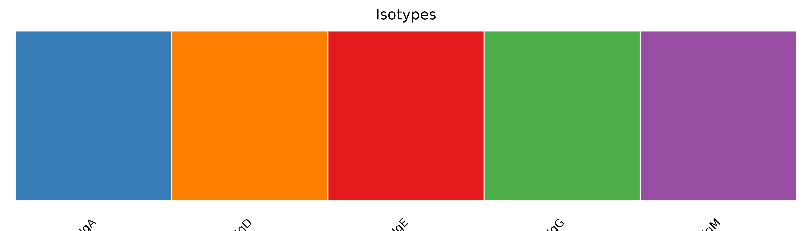

``` r

show_palette(named_colors$c_call, "Constant-region calls")
```

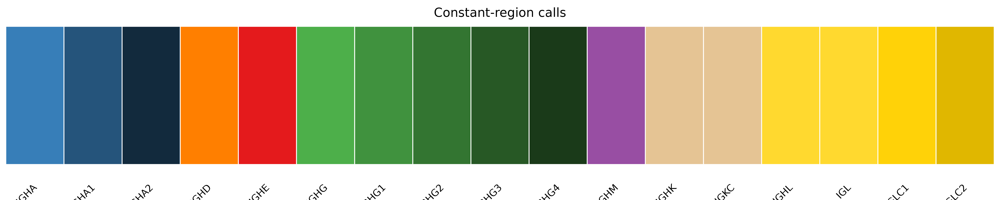

### Isotype switching stage

``` r

show_palette(named_colors$isotype_stage, "Isotype switching stage")
```

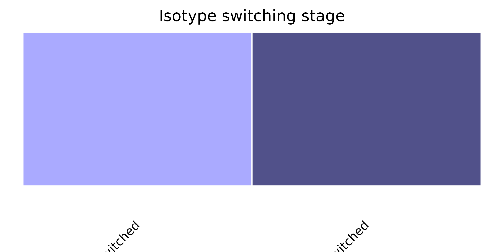

### Light chain locus

``` r

show_palette(named_colors$light, "Light chain loci")
```

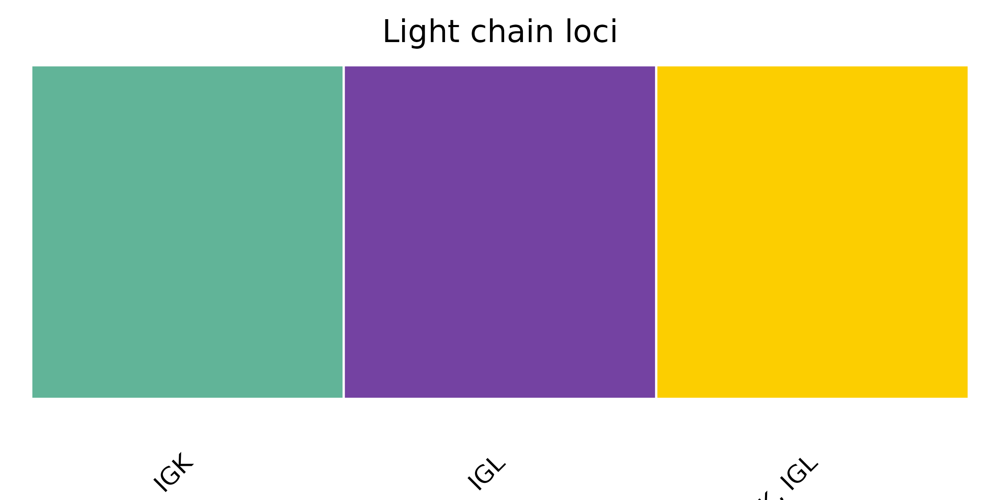

### Somatic hypermutation frequency bins

Note that the default binned colors are not named as the maximum bin
depends on the dataset.

``` r

p1 <- show_palette(named_colors$mu_freq_bins_binary, "Binary bins (2)")
p2 <- show_palette(named_colors$mu_freq_bins_fewer, "3-bin scheme")
p3 <- show_palette(named_colors$mu_freq_bins, "5-bin scheme")
p4 <- show_palette(named_colors$mu_freq_iso, "SHM × isotype stage")

(p1 + p2) / (p3 + p4)
```

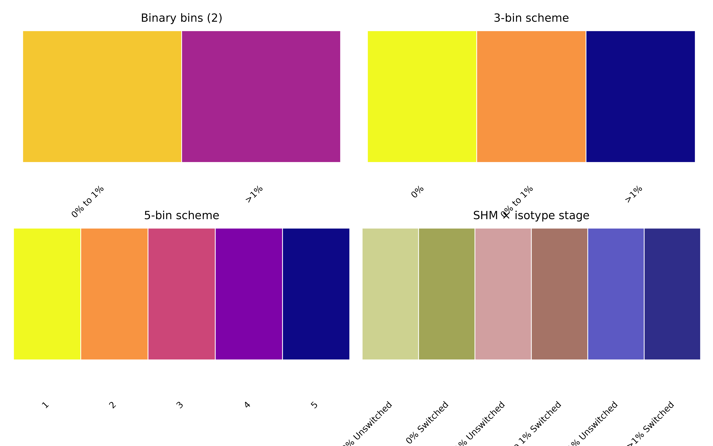

### V gene families

``` r

p_igh <- show_palette(named_colors$v_call_igh_family, "IGHV families")
p_igk <- show_palette(named_colors$v_call_igk_family, "IGKV families")
p_igl <- show_palette(named_colors$v_call_igl_family, "IGLV families")

p_igh / p_igk / p_igl
```

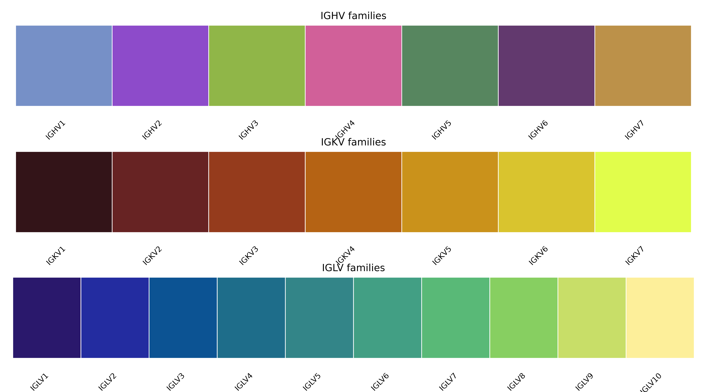

------------------------------------------------------------------------

## 3. General palettes

### Data types and modalities

``` r

show_palette(named_colors$datatype, "Data types")
```

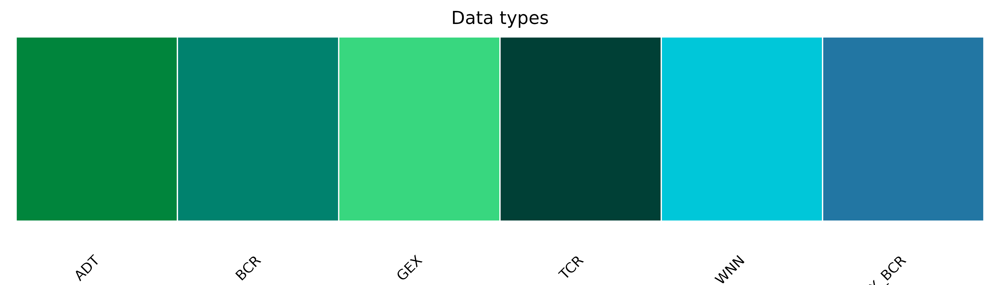

### Cell type annotations

``` r

show_palette(named_colors$cell_types_celltypist, "CellTypist cell types")
```

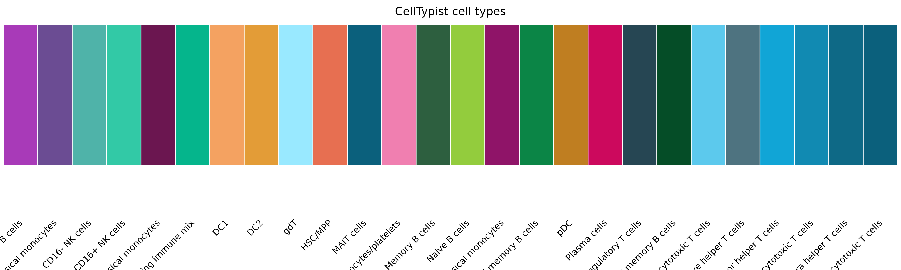

### CDR3 length

``` r

# show every 4th name to avoid overplotting
cdr3_sub <- named_colors$cdr3[seq(1, length(named_colors$cdr3), 4)]
show_palette(cdr3_sub, "CDR3 length (subset of range 4–41)")
```

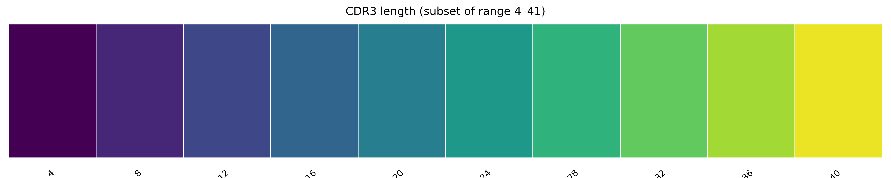

### Embedding methods

``` r

show_palette(named_colors$embeddings, "Embedding methods")
```

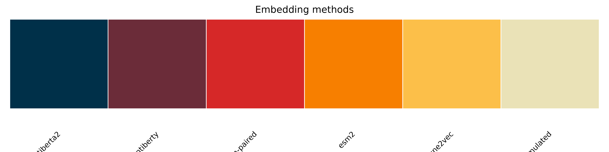

------------------------------------------------------------------------

## 4. Using palettes with plotting functions

All `plot_*` functions in `athanor` accept a `clrs_specific` argument.
Pass a `named_colors` entry whose names match the values in the metadata
column being plotted.

### Simulated Seurat object

``` r

n_cells <- 300
n_genes <- 200

obj <- sim_gex_splatter(num_genes = n_genes, num_cells = n_cells,
                        splatter_groups = c(0.5, 0.4, 0.1),
                        splatter_method = "groups")

obj <- seurat_pipeline(obj, nfeatures_RNA = 0, perc_mt = 100,
                       num_features = n_genes, num_pcs = 15, num_dims = 10,
                       k_param = 20, cluster_res = 0.5, verbose = FALSE)

# add BCR metadata
obj$isotype <- factor(sample(c("IgM", "IgD", "IgA", "IgG"), n_cells,
                              replace = TRUE, prob = c(0.35, 0.15, 0.30, 0.20)))
obj$mu_freq <- round(runif(n_cells, 0, 0.25), 3)
obj <- bin_mu_freq(obj)
```

``` r

plot_dimplot(seurat_obj = obj, data_source = "Simulated",
             clrs_specific = named_colors$isotype, meta_col = "isotype",
             reduc = "rna.umap", title = "Isotype", legend_label = "Isotype",
             plot_label = FALSE)
```

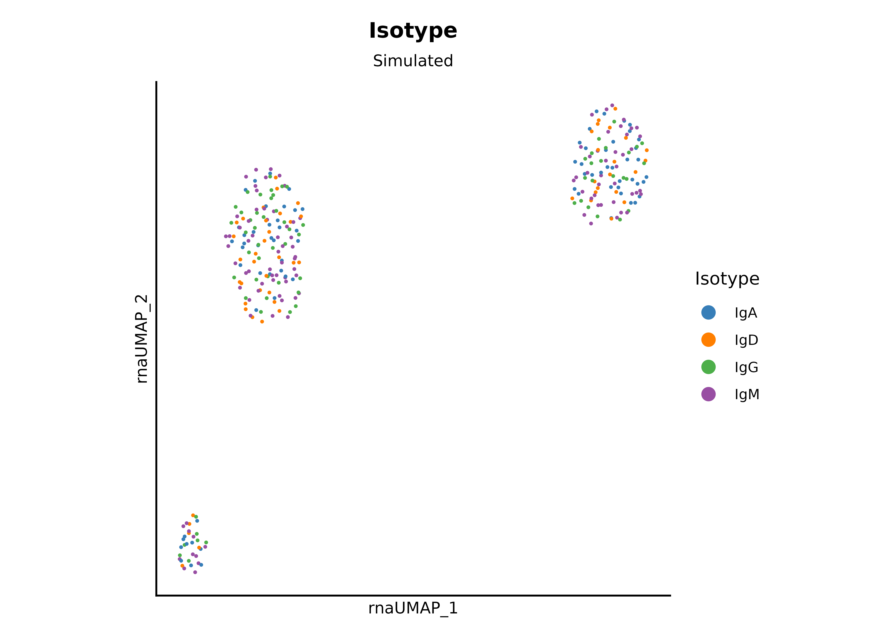

``` r

plot_vln_feat(seurat_obj = obj,
              clrs_specific = named_colors$mu_freq_bins_fewer,
              feature = "mu_freq", meta_col = "mu_freq_bins_fewer",
              title = "SHMfrequency", reduc = "rna.umap")
```

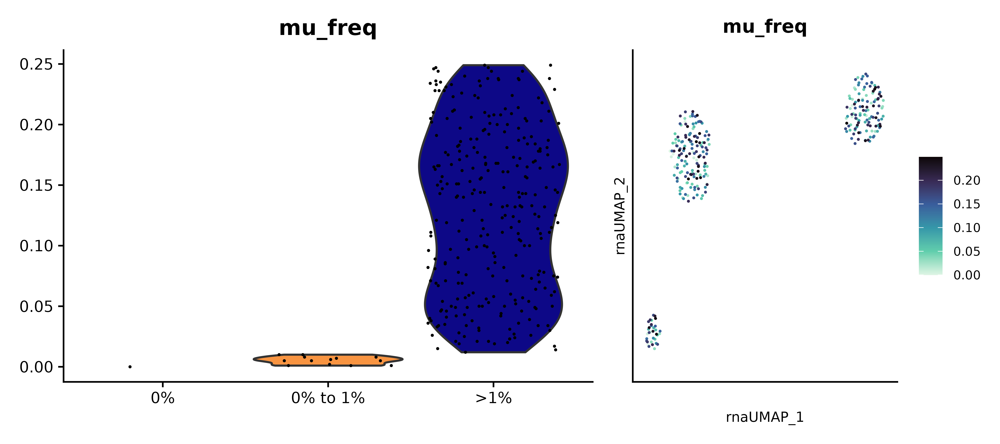

If a value in your data has no matching entry in `clrs_specific`,
`athanor` will fall back to a default ggplot2 color scale. To add colors
for custom categories, extend the relevant palette:

``` r

my_colors <- c(named_colors$isotype, "NA" = "#cccccc")
my_colors
#>       IgA       IgD       IgE       IgG       IgM        NA 
#> "#377EB8" "#FF7F00" "#E41A1C" "#4DAF4A" "#984EA3" "#cccccc"
```

------------------------------------------------------------------------

## 5. Continuous color scales with `plot_color_scale()`

[`plot_color_scale()`](https://eba28.github.io/athanor/reference/plot_color_scale.md)
anchors a diverging palette so that zero maps to white and the positive
/ negative extremes are symmetric. This is particularly useful for
Seurat `DotPlot` output, where the default color mapping can
misrepresent where zero falls.

``` r

# continuous example with a regular ggplot2
p <- ggplot(mtcars, aes(x = wt, y = mpg, color = mpg)) +
      geom_point(size = 3) +
      labs(title = "mtcars: mpg", subtitle = "Default scale")

# you can specify which column to pull values from
p_scaled <- plot_color_scale(plot = p, val_col = "mpg") +
              labs(title = "mtcars: mpg", subtitle = "Custom scale")

(p + p_scaled) & athanor::theme_bw_custom & athanor::labels_standard
```

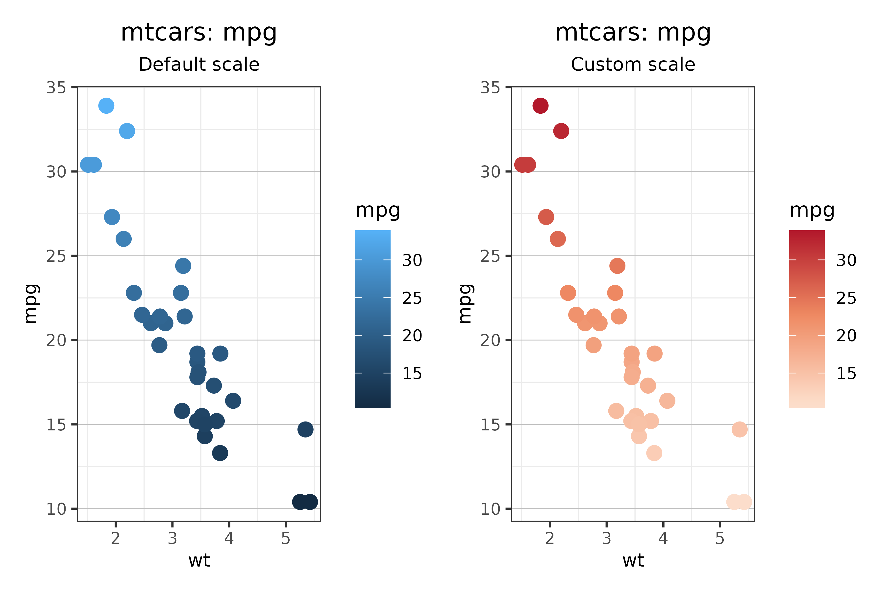

``` r

# typical usage with a Seurat DotPlot
p <- DotPlot(obj, features = stringr::str_c("Gene", 1:10), assay = "RNA")

# you can pass a plot in with a pipe
p %>% plot_color_scale() # default parameters
```

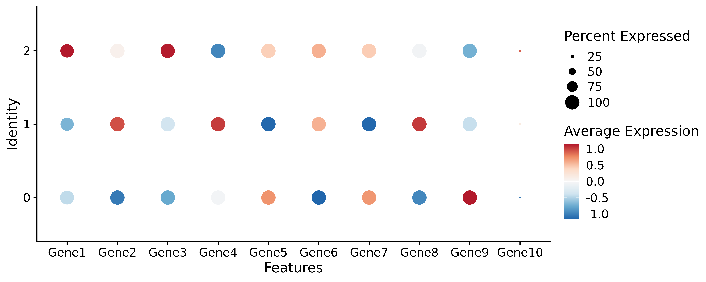

``` r


# can change the colors as desired
plot_color_scale(plot = p, palette = rev(pals::brewer.brbg(n = 5)))
```

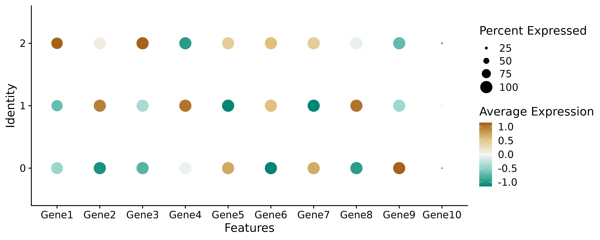

The `palette` argument accepts any vector of colors, defaulting to a
red–blue diverging scheme from
[`pals::brewer.rdbu`](https://kwstat.github.io/pals/reference/brewer.html).
Use `fill_by = "fill"` for geoms that use the fill aesthetic rather than
color.
