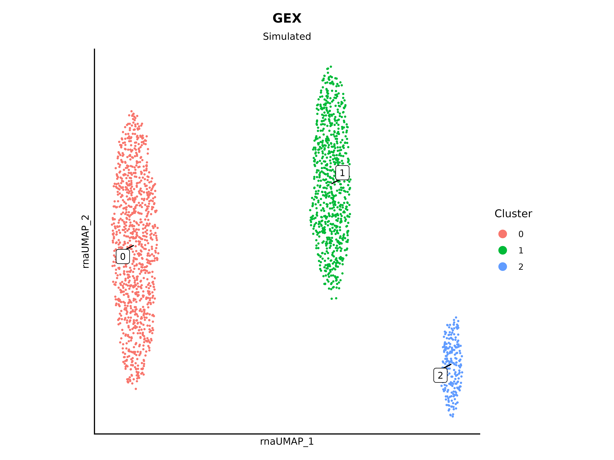
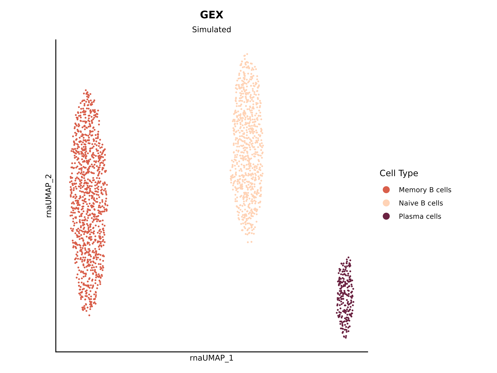
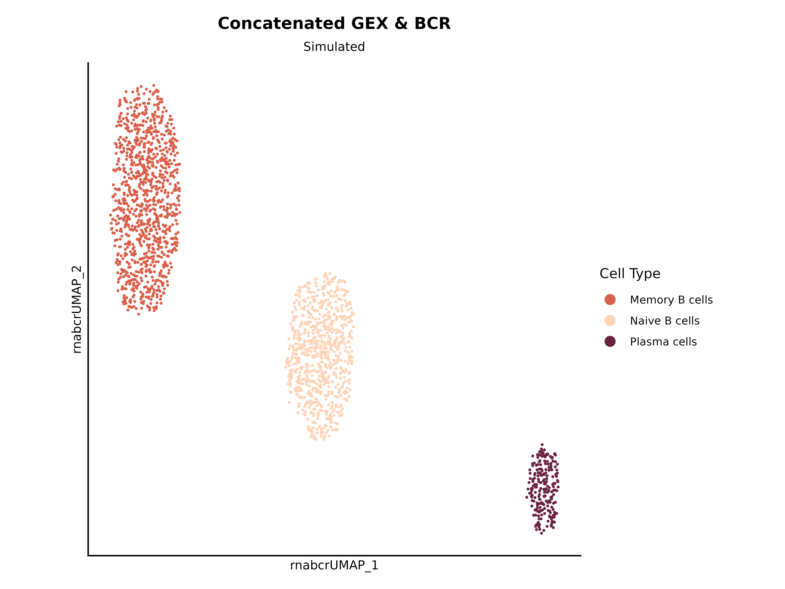
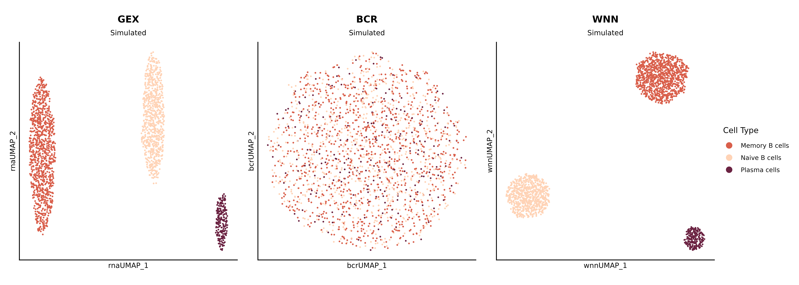
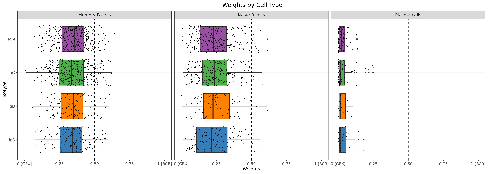
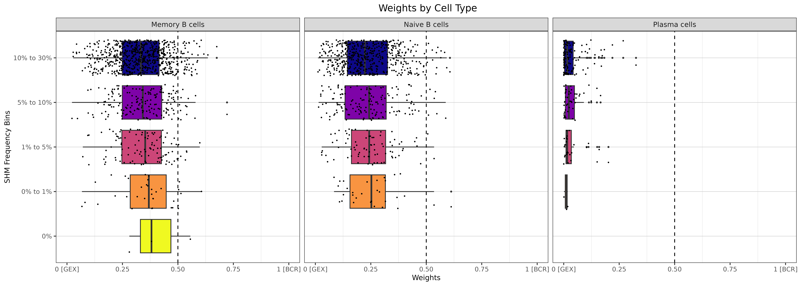

# Main processing pipeline: GEX, concatenation, and WNN

This vignette walks through the full `athanor` pipeline on simulated
data:

1.  **GEX processing**:
    [`seurat_pipeline()`](https://eba28.github.io/athanor/reference/seurat_pipeline.md) +
    [`add_annotations()`](https://eba28.github.io/athanor/reference/add_annotations.md)
2.  **BCR metadata**: adding AIRR-derived features to the Seurat object
3.  **Concatenation**:
    [`concatenate_gex_bcr()`](https://eba28.github.io/athanor/reference/concatenate_gex_bcr.md)
    combines gene expression and BCR features into a single assay
4.  **WNN**:
    [`run_wnn()`](https://eba28.github.io/athanor/reference/run_wnn.md)
    integrates GEX and BCR embeddings via Seurat’s Weighted Nearest
    Neighbors
5.  **Evaluation**: ADT-based metrics across methods

------------------------------------------------------------------------

## Setup

``` r

library(athanor)
library(dplyr)
library(ggplot2)
library(Matrix)
library(patchwork)
library(recipes)
library(Seurat)

set.seed(42)
```

------------------------------------------------------------------------

## 1. GEX processing

### Simulate and build the initial object

[`sim_gex_manual()`](https://eba28.github.io/athanor/reference/sim_gex_manual.md)
generates a sparse count matrix and wraps it in a Seurat object. It also
adds a `cell_id` column to the metadata, which is required downstream by
[`run_wnn()`](https://eba28.github.io/athanor/reference/run_wnn.md).

We also attach a small ADT assay (in real experiments this would hold
cell surface protein counts) since its presence is expected by
[`run_wnn()`](https://eba28.github.io/athanor/reference/run_wnn.md).

``` r

num_cells <- 2000
num_genes <- 500
num_proteins <- 6
data_desc <- "Simulated"

# TODO: put the memory and naive B cells into one cluster
obj <- sim_gex_splatter(num_genes = num_genes, num_cells = num_cells,
                        splatter_groups = c(0.4, 0.5, 0.1),
                        splatter_method = "groups")

# add a small ADT assay
adt_counts <- Matrix(as.integer(rexp(num_proteins * num_cells, rate = 0.3)),
                     nrow = num_proteins, ncol = num_cells, sparse = TRUE)
rownames(adt_counts) <- c("CD19", "CD21", "CD27", "CD38", "IGD", "IGM")
colnames(adt_counts) <- Cells(obj)
obj[["ADT"]] <- CreateAssay5Object(counts = adt_counts)

# confirm that cell_id is present
head(obj$cell_id)
#>   Cell1   Cell2   Cell3   Cell4   Cell5   Cell6 
#> "Cell1" "Cell2" "Cell3" "Cell4" "Cell5" "Cell6"
```

### Run the GEX pipeline

[`seurat_pipeline()`](https://eba28.github.io/athanor/reference/seurat_pipeline.md)
runs normalization, variable feature selection, scaling, PCA, neighbor
finding, and UMAP. Passing `nfeatures_RNA = 0` and `perc_mt = 100` skips
QC filtering (appropriate for simulated data with no mitochondrial
genes). A higher `cluster_res` gives more granular clusters, which is
useful for annotation.

``` r

obj <- seurat_pipeline(obj, nfeatures_RNA = 0, perc_mt = 100,
                       num_features = num_genes, num_pcs = 15, num_dims = 10,
                       k_param = 20, cluster_res = 0.5, verbose = FALSE)

# reductions and cluster column produced
names(obj@reductions)
#> [1] "rpca"     "rna.umap"
levels(obj$seurat_clusters)
#> [1] "0" "1" "2"
```

``` r

plot_dimplot(obj, title = "GEX", data_source = data_desc,
             meta_col = "seurat_clusters", reduc = "rna.umap")
```



### Annotate clusters

[`add_annotations()`](https://eba28.github.io/athanor/reference/add_annotations.md)
maps a data frame of cluster-to-cell-type assignments onto the Seurat
object. The data frame must have one row per cluster in the same order
as `levels(seurat_clusters)`.

``` r

# TODO: annotate on a cell level instead to simulate automated annotation

n_clusters <- nlevels(obj$seurat_clusters)

# one cell type label per cluster
# cell_types <- sample(c("Memory B cells", "Naive B cells", "Plasma cells",
#                        "Transitional B cells"), size = n_clusters,
#                      replace = TRUE, prob = c(0.4, 0.4, 0.1, 0.1))

# we chose to have 3 clusters during simulation, so let's define them directly
cell_types <- c("Memory B cells", "Naive B cells", "Plasma cells")

annotations_df <- data.frame(CellType = cell_types)

obj <- add_annotations(seurat_obj = obj, annotations_df = annotations_df,
                       cell_types_col = "CellType",
                       clusters_col = "seurat_clusters",
                       annotations_col = "annotated_clusters")

table(obj$annotated_clusters)
#> 
#> Memory B cells  Naive B cells   Plasma cells 
#>           1023            762            215
```

``` r

plot_dimplot(obj, data_source = data_desc,
             clrs_specific = named_colors$cell_types_celltypist,
             title = "GEX", reduc = "rna.umap",
             meta_col = "annotated_clusters",
             plot_label = FALSE, legend_label = "Cell Type")
```



------------------------------------------------------------------------

## 2. BCR metadata

In a real experiment these columns come from
[`gex_add_airr()`](https://eba28.github.io/athanor/reference/gex_add_airr.md)
applied to an AIRR-formatted table. Here we simulate them directly so
that the downstream steps are self-contained.

- `cdr3_aa_length` = CDR3 length bucket (ordered factor)
  - Can also be numeric
- `isotype` = BCR isotype (categorical)
- `mu_freq` = somatic hypermutation frequency (numeric)

``` r

obj$cdr3_aa_length <- factor(sample(c("Short", "Medium", "Long"), num_cells,
                                    replace = TRUE),
                             levels = c("Short", "Medium", "Long"),
                             ordered = TRUE)
obj$isotype <- factor(sample(c("IgM", "IgD", "IgG", "IgA"), num_cells,
                             replace = TRUE,
                             prob = c(0.35, 0.15, 0.35, 0.15)))
obj$mu_freq <- round(runif(num_cells, min = 0, max = 0.3), 3)

obj[[]] %>%
  select(mu_freq, cdr3_aa_length, isotype) %>%
  summary()
#>     mu_freq       cdr3_aa_length isotype  
#>  Min.   :0.0000   Short :676     IgA:305  
#>  1st Qu.:0.0770   Medium:664     IgD:265  
#>  Median :0.1550   Long  :660     IgG:709  
#>  Mean   :0.1513                  IgM:721  
#>  3rd Qu.:0.2260                           
#>  Max.   :0.3000
```

------------------------------------------------------------------------

## 3. Concatenation

[`concatenate_gex_bcr()`](https://eba28.github.io/athanor/reference/concatenate_gex_bcr.md)
combines the RNA counts with processed BCR feature columns into a new
`RNA_BCR` assay, then runs PCA and UMAP on the joint space.
`pca_stage = "Before"` means the BCR features are concatenated *before*
PCA; set it to `"After"` to combine pre-computed GEX and BCR PCA
embeddings instead.

`cols_to_include` lists the BCR metadata columns to pull into the assay.
Internally,
[`process_bcr_features()`](https://eba28.github.io/athanor/reference/process_bcr_features.md)
normalizes numeric columns, converts ordered factors to ordinal scores,
and one-hot encodes categoricals.

``` r

# keep a copy so run_wnn() below starts from the same object
obj_cat <- concatenate_gex_bcr(obj, pca_stage = "raw",
                               cols_to_include =
                                 c("cdr3_aa_length", "isotype", "mu_freq"),
                               normalize = TRUE, num_dims = 10)

# new assay and reductions
names(obj_cat@assays)
#> [1] "RNA"     "ADT"     "RNA_BCR"
names(obj_cat@reductions)
#> [1] "rpca"         "rna.umap"     "rna_bcr.pca"  "rna_bcr.umap"
```

``` r

plot_dimplot(obj_cat, data_source = data_desc,
             clrs_specific = named_colors$cell_types_celltypist,
             title = "Concatenated GEX & BCR", reduc = "rna_bcr.umap",
             meta_col = "annotated_clusters",
             plot_label = FALSE, legend_label = "Cell Type")
```



------------------------------------------------------------------------

## 4. WNN

[`run_wnn()`](https://eba28.github.io/athanor/reference/run_wnn.md)
integrates two modalities via Weighted Nearest Neighbors. It expects:

- a Seurat object with a `cell_id` column in the metadata
- a BCR `embeddings` matrix (features × cells) whose column names match
  `cell_id`

Here we simulate an immune2vec-style embedding matrix directly.

``` r

num_dims_bcr <- 20

bcr_embeddings <-
  matrix(round(runif(num_cells * num_dims_bcr, min = -0.6, max = 0.6), 9),
         nrow = num_dims_bcr, ncol = num_cells)
rownames(bcr_embeddings) <- paste0("Dim-", seq_len(num_dims_bcr))
colnames(bcr_embeddings) <- obj$cell_id  # must match cell_id

# verify alignment
all(colnames(bcr_embeddings) == obj$cell_id)
#> [1] TRUE
```

``` r

obj_wnn <- run_wnn(obj, embeddings = bcr_embeddings,
                   embedding_type = "Simulated",
                   pc_gex = 10, pc_bcr = 10, k_param = 20, cluster = TRUE,
                   cluster_res = list("GEX" = 0.5, "BCR" = 0.5, "WNN" = 0.5),
                   verbose = FALSE)

# bin the mutation frequency for plotting
obj_wnn <- bin_mu_freq(obj_wnn)

names(obj_wnn@reductions)
#> [1] "rpca"     "rna.umap" "bpca"     "bcr.umap" "wnn.umap"
```

### Visualization

UMAPs:

``` r

p_gex <- plot_dimplot(obj_wnn, title = "GEX", data_source = data_desc,
                      clrs_specific = named_colors$cell_types_celltypist,
                      meta_col = "annotated_clusters", reduc = "rna.umap",
                      plot_label = FALSE, legend_label = "Cell Type")
p_bcr <- plot_dimplot(obj_wnn, title = "BCR", data_source = data_desc,
                      clrs_specific = named_colors$cell_types_celltypist,
                      meta_col = "annotated_clusters", reduc = "bcr.umap",
                      plot_label = FALSE, legend_label = "Cell Type")
p_wnn <- plot_dimplot(obj_wnn, title = "WNN", data_source = data_desc,
                      clrs_specific = named_colors$cell_types_celltypist,
                      meta_col = "annotated_clusters", reduc = "wnn.umap",
                      plot_label = FALSE, legend_label = "Cell Type")

# use patchwork
(p_gex + p_bcr + p_wnn) + plot_layout(nrow = 1, guides = "collect")
```



Modality weights:

``` r

# by isotype
plot_mws(seurat_obj = obj_wnn, second_assay = "BCR",
         clrs_specific = named_colors$isotype, split_by = "isotype",
         facet_by = "annotated_clusters", y_axis_label = "Isotype")
```



``` r


# by SHM frequency
plot_mws(seurat_obj = obj_wnn, second_assay = "BCR",
         clrs_specific = named_colors$mu_freq_bins, split_by = "mu_freq_bins",
         facet_by = "annotated_clusters", y_axis_label = "SHM Frequency Bins")
```



### Object summary

[`object_overview()`](https://eba28.github.io/athanor/reference/object_overview.md)
prints a brief description of the post-WNN object, including assay sizes
and the number of PCs used per modality.

``` r

object_overview(obj_wnn)
```

------------------------------------------------------------------------

## 5. Evaluation

------------------------------------------------------------------------

## Summary of the pipeline

| Step | Function | Key output |
|----|----|----|
| Simulate GEX | [`sim_gex_manual()`](https://eba28.github.io/athanor/reference/sim_gex_manual.md) | Seurat object with `cell_id` |
| GEX pipeline | [`seurat_pipeline()`](https://eba28.github.io/athanor/reference/seurat_pipeline.md) | `rpca`, `rna.umap`, `seurat_clusters` |
| Annotate | [`add_annotations()`](https://eba28.github.io/athanor/reference/add_annotations.md) | `annotated_clusters` in metadata |
| Add BCR features | [`gex_add_airr()`](https://eba28.github.io/athanor/reference/gex_add_airr.md) / manual | BCR columns in metadata |
| Concatenation | [`concatenate_gex_bcr()`](https://eba28.github.io/athanor/reference/concatenate_gex_bcr.md) | `RNA_BCR` assay, `rna_bcr.umap` |
| WNN | [`run_wnn()`](https://eba28.github.io/athanor/reference/run_wnn.md) | `bpca`, `bcr.umap`, `wnn.umap` |
| Describe object | [`object_overview()`](https://eba28.github.io/athanor/reference/object_overview.md) | printed summary |
