# Visualizing scRNA-Seq data with plot_dimplot()

[`plot_dimplot()`](https://eba28.github.io/athanor/reference/plot_dimplot.md)
wraps Seurat’s
[`DimPlot()`](https://satijalab.org/seurat/reference/DimPlot.html) with
consistent styling and a flexible `meta_col` argument, making it easy to
overlay any categorical metadata column onto a UMAP (or other
dimensionality reduction). This vignette shows three common use cases:

1.  **GEX metadata** — Seurat clusters and cell-type annotations
2.  **BCR metadata** — BCR features transferred from paired AIRR data
3.  **ADT expression** — cell surface protein levels via
    [`FeaturePlot()`](https://satijalab.org/seurat/reference/FeaturePlot.html)

## Setup

#### Initial GEX object

``` r
library(athanor)
library(ggplot2)
library(Matrix)
library(patchwork)
library(Seurat)

set.seed(42)

# could change these
num_genes <- 400
num_cells <- 200
num_proteins <- 6
named_clrs <- list() # so that there aren't a bunch of color variables

# TODO: use my simple simulator functions
gex_counts <- Matrix(as.integer(rexp(num_genes * num_cells, rate = 0.5)),
                     nrow = num_genes, ncol = num_cells, sparse = TRUE)
adt_counts <- Matrix(as.integer(rexp(num_proteins * num_cells, rate = 0.3)),
                     nrow = num_proteins, ncol = num_cells, sparse = TRUE)

rownames(gex_counts) <- paste0("Gene-", seq_len(num_genes))
colnames(gex_counts) <- paste0("Cell-", seq_len(num_cells))
rownames(adt_counts) <- c("CD19", "CD21", "CD27", "CD38", "IGD", "IGM")
colnames(adt_counts) <- colnames(gex_counts)

obj <- CreateSeuratObject(counts = gex_counts, project = "Example")
obj[["ADT"]] <- CreateAssayObject(counts = adt_counts)

# TODO: show real QC
obj <- seurat_pipeline(obj, nfeatures_RNA = 0, perc_mt = 100,
                       num_features = 400, num_pcs = 15, num_dims = 10,
                       k_param = 15, cluster_res = 0.5, verbose = FALSE)

# add some B cell types
# TODO: include non-B cell types as well
obj$annotated_clusters <- sample(c("Memory B cells", "Naive B cells",
                                   "Plasma cells", "Transitional B cells"),
                                 num_cells, replace = TRUE)
```

### Adding BCR metadata

After running
[`gex_add_airr()`](https://eba28.github.io/athanor/reference/gex_add_airr.md)
and
[`process_bcr_features()`](https://eba28.github.io/athanor/reference/process_bcr_features.md)
on real data, BCR-derived columns are available in `obj@meta.data`. Here
we simulate them for illustration:

``` r
# TODO: correlate these values with cell types instead of having them be random

# TODO: change these to actual numbers
obj$cdr3_aa_length <-
  sample(c("Short", "Medium", "Long"), num_cells, replace = TRUE)
obj$isotype <-
  sample(c("IgM", "IgD", "IgG", "IgA", "IgE"), num_cells, replace = TRUE,
         prob = c(0.35, 0.15, 0.30, 0.15, 0.05))
obj$locus_light <-
  sample(c("IGK", "IGL"), num_cells, replace = TRUE)
obj$mu_freq_bins <-
  sample(c("0%", "0% to 1%", "1% to 5%", "5% to 10%", "10% to 25%"),
         num_cells, replace = TRUE)
obj$v_call_family <-
  sample(paste0("IGHV", 1:7), num_cells, replace = TRUE)
```

------------------------------------------------------------------------

## 1. GEX Metadata

### Seurat clusters

The simplest call colors cells by `seurat_clusters` (the default
`meta_col`). Passing the assay name to `assay` populates the plot title.

``` r
# could also just use umap
plot_dimplot(seurat_obj = obj, assay = "GEX", data_source = "Example dataset",
             reduc = "rna.umap")
```

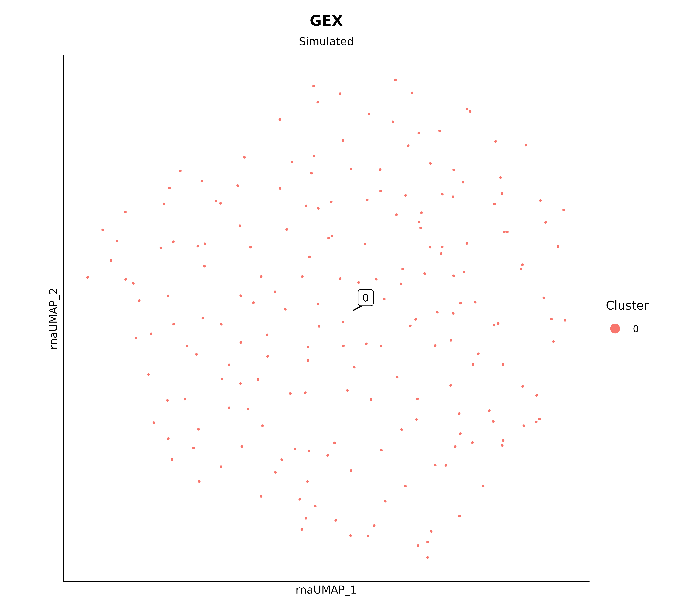

To suppress labels and the legend:

``` r
plot_dimplot(seurat_obj = obj, assay = "GEX", data_source = "Example dataset",
             plot_label = FALSE, include_legend = FALSE, reduc = "rna.umap")
```

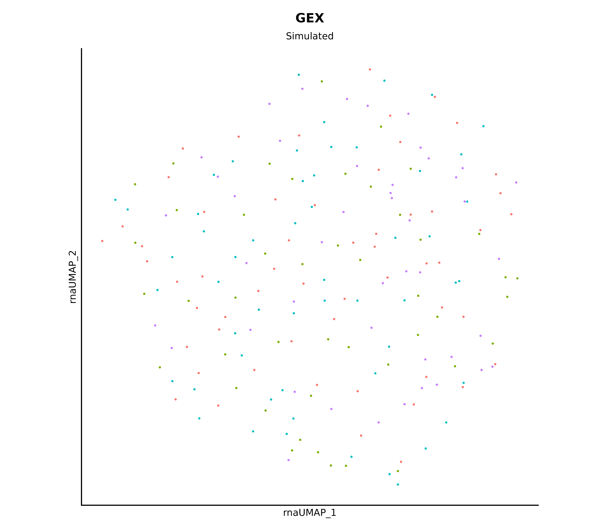

### Cell type annotations

Set `annotated = TRUE` to switch the legend title to “Cell Type” and
sort levels alphabetically.

``` r
named_clrs$annotated_clusters <-
  c("Naive B cells" = "#93cc3d", "Memory B cells" = "#2d5f3f",
    "Plasma cells" = "#cc095d", "Transitional B cells" = "#22e6e6")

plot_dimplot(seurat_obj = obj, assay = "GEX", data_source = "Example dataset",
             clrs_specific = named_clrs$annotated_clusters,
             meta_col = "annotated_clusters",
             annotated = TRUE, plot_label = FALSE, reduc = "rna.umap")
```

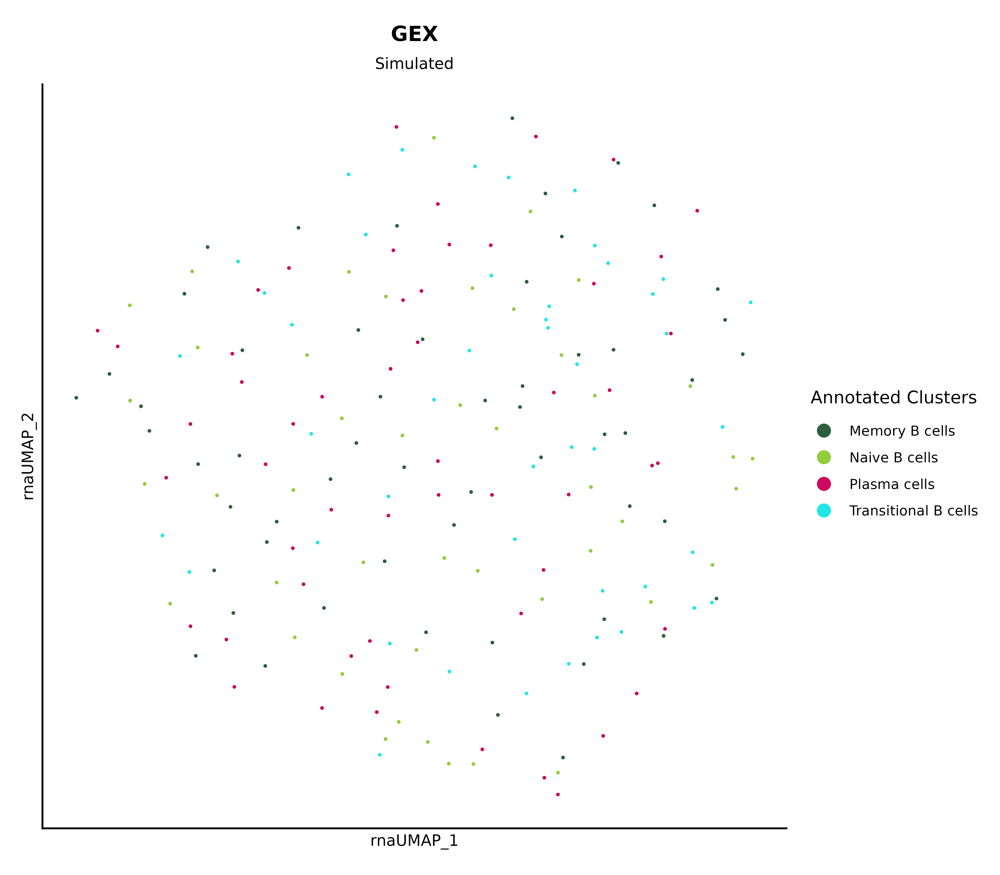

### Highlighting specific populations

Pass a character vector to `specific_clusters` to draw a subset of cells
on top of a grey background.

``` r
plot_dimplot(seurat_obj = obj, assay = "GEX",
             specific_clusters = c("Naive B cells", "Plasma cells"),
             meta_col = "annotated_clusters", reduc = "rna.umap")
```

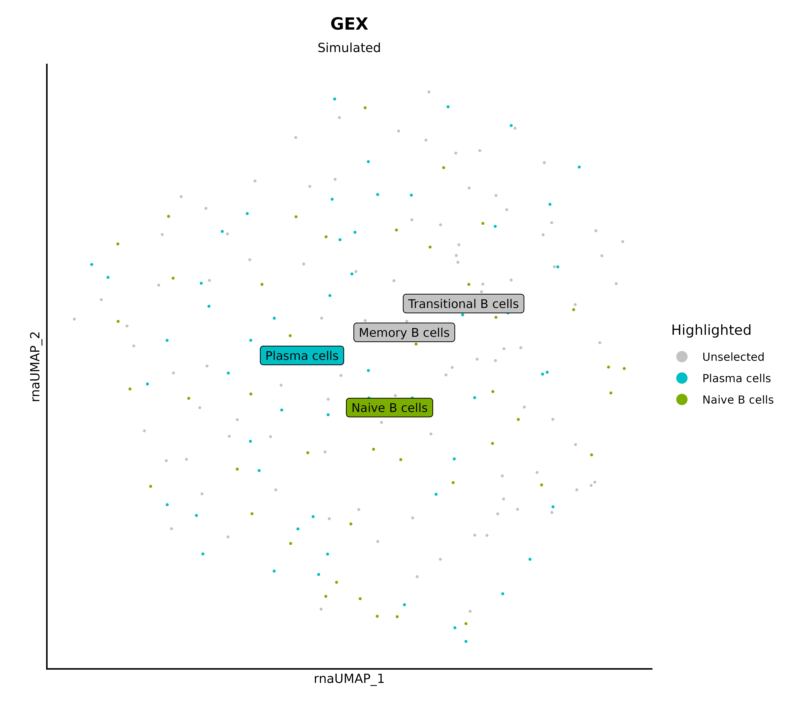

------------------------------------------------------------------------

## 2. BCR Metadata

BCR-derived columns from
[`process_bcr_features()`](https://eba28.github.io/athanor/reference/process_bcr_features.md)
and
[`gex_add_airr()`](https://eba28.github.io/athanor/reference/gex_add_airr.md)
are transferred into the GEX Seurat object, so they are plotted exactly
like any other metadata column.

### CDR3 length

``` r
# named_clrs$cdr3 <- setNames(viridis(length(4:41)), nm = 4:41)
named_clrs$cdr3 <- c(Short = "#482778", Medium = "#20938C", Long = "#C9E020")

plot_dimplot(seurat_obj = obj, assay = "CDR3 Length",
             meta_col = "cdr3_aa_length", clrs_specific = named_clrs$cdr3,
             plot_label = FALSE, legend_label = "CDR3 Length",
             reduc = "rna.umap")
```

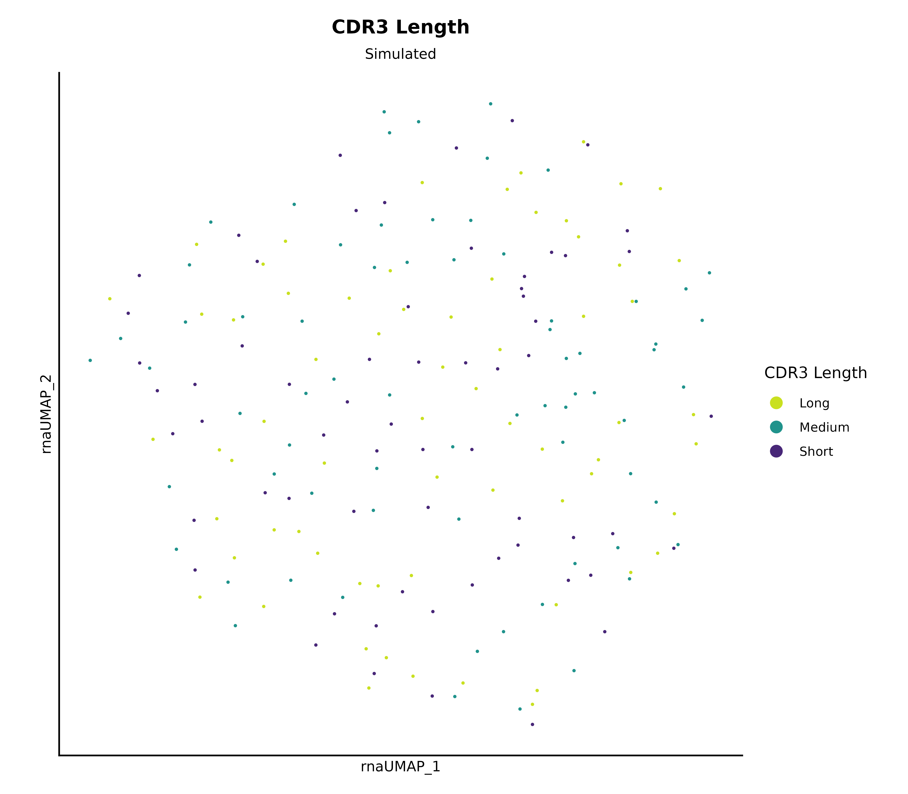

### Isotype

``` r
# uses the colors from the alakazam package
named_clrs$isotype <- c("IgA" = "#377EB8", "IgD" = "#FF7F00", "IgE" = "#E41A1C",
                        "IgG" = "#4DAF4A", "IgM" = "#984EA3")

plot_dimplot(seurat_obj = obj, assay = "BCR Isotype", meta_col = "isotype",
             clrs_specific = named_clrs$isotype, plot_label = FALSE,
             legend_label = "Isotype", reduc = "rna.umap")
```

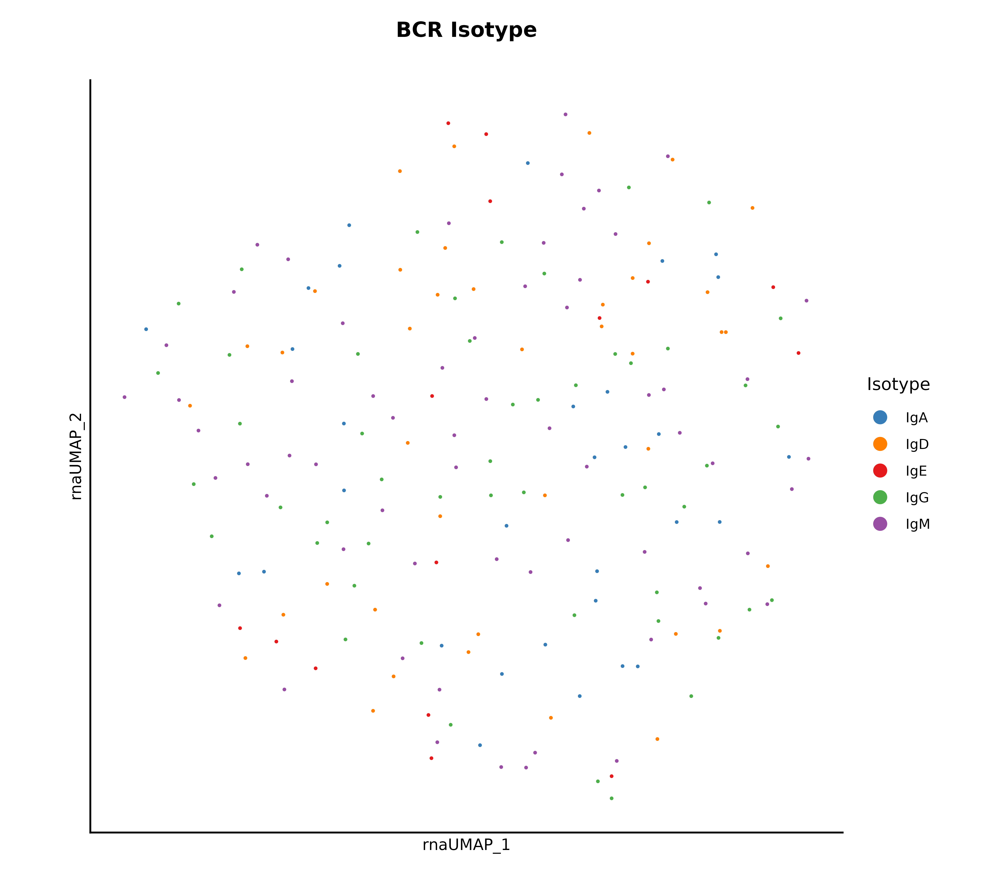

### SHM frequency

You could also use a `FeaturePlot` to see the actual values.

``` r
# named_clrs$mu_freq_bins <-
#   viridis_pal(direction = -1, option = "C")(n = 5) %>% str_sub(1, 7)
# note that the last bin's name is dependent on your dataset
named_clrs$mu_freq_bins <- c("0%" = "#F0F921", "0% to 1%" = "#F89441",
                             "1% to 5%%" = "#CC4678", "5% to 10%" = "#7E03A8",
                             "10% to 25%" = "#0D0887")

# be careful with the order
plot_dimplot(seurat_obj = obj, assay = "SHM Frequency",
             meta_col = "mu_freq_bins",
             clrs_specific = named_clrs$mu_freq_bins, plot_label = FALSE,
             legend_label = "SHM Bins", order = TRUE, reduc = "rna.umap")
```

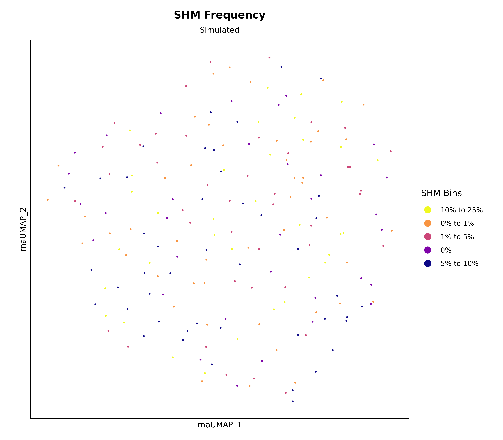

### V gene family

``` r
named_clrs$v_call_family <-
  setNames(c("#7690c7", "#8d4bca", "#90b648", "#d16099", "#57865f", "#62396e",
             "#bc9149"), nm = stringr::str_c("IGHV", 1:7))

plot_dimplot(seurat_obj = obj, assay = "V Gene Family",
             clrs_specific = named_clrs$v_call_family,
             meta_col = "v_call_family", plot_label = FALSE,
             legend_label = "V Gene Family", reduc = "rna.umap")
```

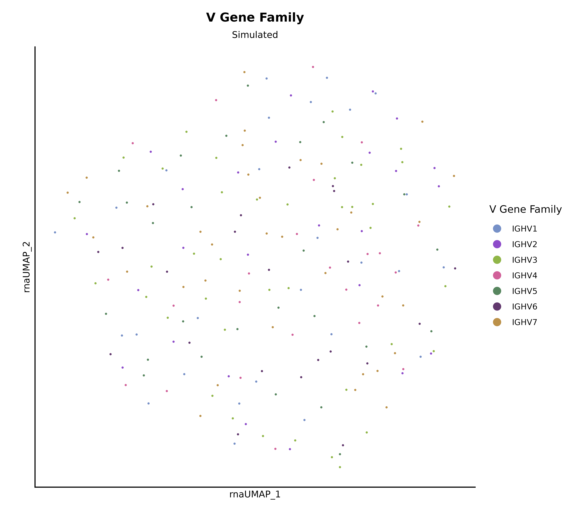

### Combining plots with patchwork

``` r
p_iso <- plot_dimplot(obj, assay = "Isotype", meta_col = "isotype",
                      clrs_specific = named_clrs$isotype, plot_label = FALSE,
                      legend_label = "Isotype", reduc = "rna.umap")
p_shm <- plot_dimplot(obj, assay = "SHM", meta_col = "mu_freq_bins",
                      clrs_specific = named_clrs$mu_freq_bins, plot_label = FALSE,
                      legend_label = "SHM Bins", order = TRUE,
                      reduc = "rna.umap")
p_cdr3 <- plot_dimplot(obj, assay = "CDR3 Length", meta_col = "cdr3_aa_length",
                       clrs_specific = named_clrs$cdr3, plot_label = FALSE,
                       legend_label = "CDR3 Length", reduc = "rna.umap")

p_iso + p_shm + p_cdr3
```

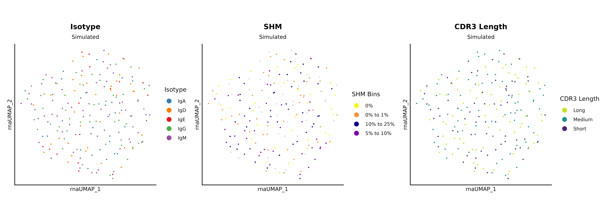

------------------------------------------------------------------------

## 3. ADT Expression

ADT features are stored as `adt_<marker>` in the Seurat object after
normalization. Because expression is continuous, these are best
visualized with Seurat’s
[`FeaturePlot()`](https://satijalab.org/seurat/reference/FeaturePlot.html)
and a sequential color scale rather than
[`plot_dimplot()`](https://eba28.github.io/athanor/reference/plot_dimplot.md).
[`seurat_pipeline()`](https://eba28.github.io/athanor/reference/seurat_pipeline.md)
automatically normalizes the ADT assay with CLR, so no extra step is
needed.

ADT features are referenced as `"adt_<marker>"` — the assay key
prepended to the feature name.

### Single marker

``` r
# use CD19 as an example
FeaturePlot(obj, features = "adt_CD19",
            reduction = "rna.umap", order = TRUE, raster = FALSE) +
  scale_color_viridis_c(option = "G", direction = -1) # name = "CD19"
```

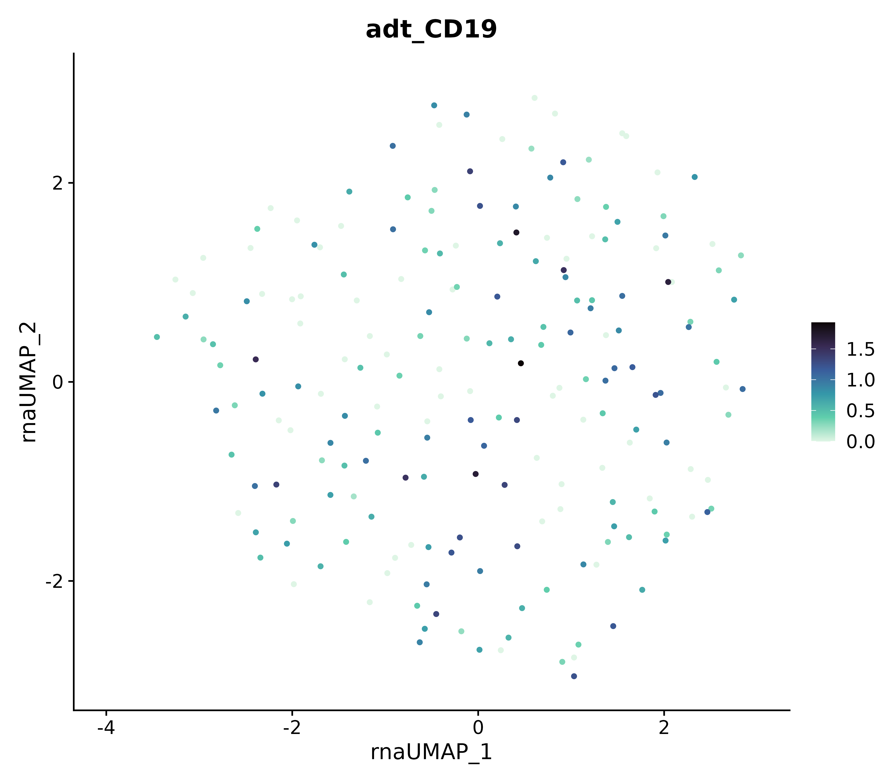

``` r
  # clean_umap
```

### Multiple markers side by side

``` r
FeaturePlot(obj, features = paste0("adt_", rownames(obj@assays$ADT@data)),
            reduction = "rna.umap", order = TRUE, ncol = 3, raster = FALSE) &
  ggplot2::scale_color_viridis_c(option = "G", direction = -1) # &
```

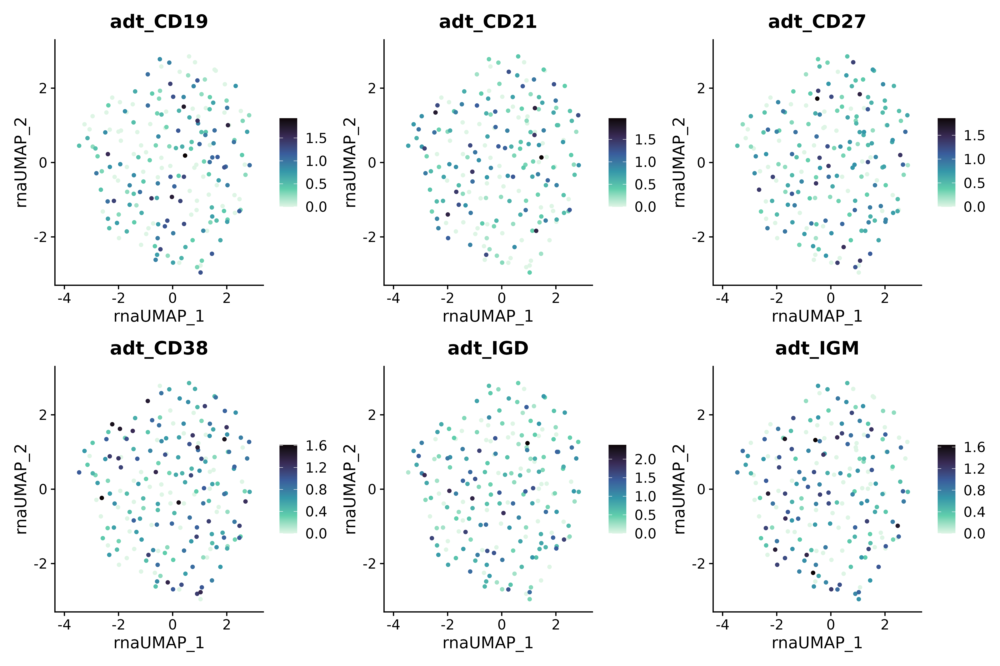

``` r
  # clean_umap
```

------------------------------------------------------------------------

## 4. Different reductions

------------------------------------------------------------------------

## Summary of key parameters

| Argument            | Purpose                                                                 |
|---------------------|-------------------------------------------------------------------------|
| `meta_col`          | Column in `@meta.data` to color by (default: `seurat_clusters`)         |
| `assay`             | Plot title (use for the data modality name)                             |
| `data_source`       | Plot subtitle (use for dataset / sample name)                           |
| `clrs_specific`     | Named color vector; auto-generated if omitted                           |
| `annotated`         | `TRUE` → legend title becomes “Cell Type”, levels sorted alphabetically |
| `specific_clusters` | Highlight a subset of levels over a grey background                     |
| `order`             | Draw cells with non-NA values on top                                    |
| `plot_label`        | Toggle cluster labels                                                   |
| `reduc`             | Reduction to plot (default: `"umap"`)                                   |
| `details`           | Optional extra subtitle line                                            |
